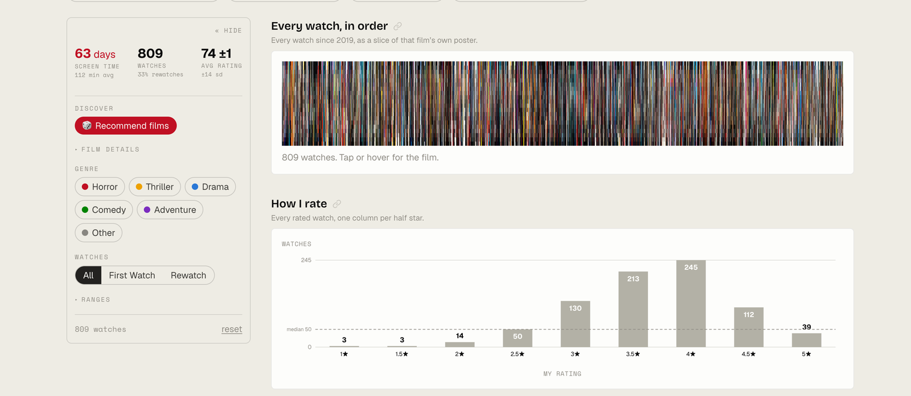
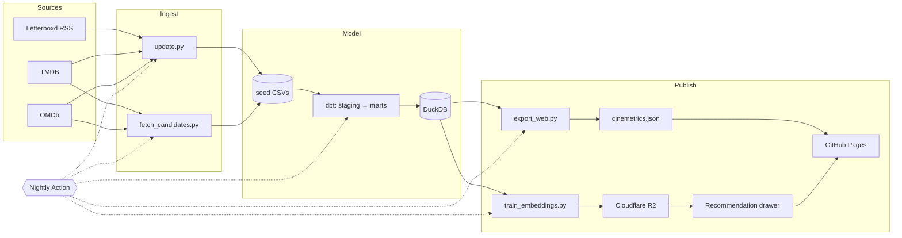

# cinemetrics

<!--stat:watches-->809<!--/stat--> viewings of <!--stat:films-->683<!--/stat--> films across <!--stat:years_word-->eight<!--/stat--> years, from a single Letterboxd account. Enriched via TMDB and OMDb, modeled with dbt in DuckDB, served as a static Next.js dashboard with an ML-powered recommendation engine.

**Live:** [featheranalytics.dev/cinemetrics](https://featheranalytics.dev/cinemetrics)



## Why this exists

A personal film analytics project that started as a spreadsheet and became an end-to-end pipeline: ingest, model, export, deploy, recommend. The interesting part is not the stack — it is what the data says when you stop lying to it about what it recorded.

## What it does

- Cross-filtered dashboard: every chart responds to every filter in real time, and every view is a shareable URL (filters, stories, and per-chart deep links).
- Guided stories: one-tap findings (Spooktober, hidden gems, double features, franchise runs) that filter the charts and annotate what they show.
- Viewing habits over time: pace, seasonality, genre drift.
- Taste alignment with critics (Metascore, Rotten Tomatoes, IMDb).
- Rewatch patterns, rating changes, and franchise runs (TMDB collections rolled up into umbrella franchises like the MCU via a dbt macro).
- Recommendation engine: candidates ranked by cosine similarity to a taste vector built from my own ratings, with EN/Non-EN toggle, dashboard filter integration, and explainable results ("Why this film").

## Data lessons

- **Three-state `liked`** — the <!--stat:sheet_era-->129<!--/stat--> pre-Letterboxd rows never recorded `liked` or `is_rewatch`. Collapsing the unknowns into `false` understates the affection rate by <!--stat:affection_delta-->7.4<!--/stat--> points. Always filter `liked is not null` first.
- **Rewatch versus return** — <!--stat:flagged_rewatches-->214<!--/stat--> rows are flagged as rewatches, but <!--stat:flagged_once-->88<!--/stat--> of those are films whose first viewing predates the dataset. Counting return visits in the data gives <!--stat:returns-->126<!--/stat--> across <!--stat:films_with_returns-->87<!--/stat--> films. State which one a figure means.
- **The factor of 20 is measured, not assumed** — `star_rating × 20 = rating_100` holds across the <!--stat:seed_rows_both-->680<!--/stat--> rows that arrived carrying both values. Derived in `stg_film_log.sql`.
- **Cut a contrast against its neighbors** — this library changed character around mid-2022. Any "everything else" bucket is mostly the high-volume, low-rated early years, so a contrast against it measures the era, not the thing.

## How it fits together



- **Seeds**: committed CSVs — [`film_log.csv`](transform/seeds/film_log.csv) (watch history), [`film_enrichment.csv`](transform/seeds/film_enrichment.csv) (rated films), [`candidate_enrichment.csv`](transform/seeds/candidate_enrichment.csv) (recommendation pool from TMDB similar + popular).
- **Staging**: cleaned, typed views over the seeds ([`transform/models/staging/`](transform/models/staging/)).
- **Marts**: [`dim_film`](transform/models/marts/dim_film.sql), [`fct_watches`](transform/models/marts/fct_watches.sql), [`dim_candidate`](transform/models/marts/dim_candidate.sql). The [`franchise_mapping()`](transform/macros/franchise_mapping.sql) macro rolls TMDB collections up into umbrella franchises by collection, film, or director rules.
- **ML pipeline**: TF-IDF + multi-hot feature encoding → cosine similarity ([`recommend/encode.py`](recommend/encode.py)). [`train_embeddings.py`](scripts/train_embeddings.py) exports sparse vectors and R2 serves them; the browser ([`web/src/lib/recommend.ts`](web/src/lib/recommend.ts)) builds a rating-weighted taste vector and does the similarity math client-side. On a leave-one-out held-out test over liked films, the balanced ranker places the held-out film at median rank <!--stat:eval_median_rank-->4,205<!--/stat--> with <!--stat:eval_hit_100-->3<!--/stat-->% in the top 100.
- **Auto-updates**: a daily GitHub Action ([`update-data.yml`](.github/workflows/update-data.yml)) fetches Letterboxd RSS, enriches new films, retrains if data changed, uploads to R2, deploys.

## Layout

| Path | Contents |
|---|---|
| [`recommend/`](recommend/) | Python: ML pipeline (feature encoding, model, explainability) |
| [`ingest/`](ingest/) | Python: TMDB + OMDb enrichment |
| [`transform/`](transform/) | dbt project (seeds → staging → marts) |
| [`scripts/`](scripts/) | export, candidate fetch, training, R2 upload |
| [`tests/`](tests/) | pytest: encoding, model, ingest, taste eval |
| [`web/`](web/) | Next.js dashboard + recommendation drawer |
| `data/` | `movies.duckdb`, `ml/` (gitignored) |

## Setup

```bash
make setup                # install Python (uv) + Node dependencies
cp .env.example .env      # add your TMDB, OMDb, and R2 keys
make build                # full pipeline: dbt → export → train → web build
make dev                  # start Next.js dev server at localhost:3000
```

See [`.env.example`](.env.example) for the full list of keys.

### Commands

All targets are defined in the [`Makefile`](Makefile).

| Command | What it does |
|---------|-------------|
| `make build` | Full pipeline: dbt build → export JSON → train embeddings → web build |
| `make dev` | Start Next.js dev server |
| `make test` | Run all tests: ruff + eslint + dbt + vitest |
| `make candidates` | Fetch candidate films from TMDB (similar + popular) |
| `make train` | Train embeddings (skips if data unchanged) |
| `make retrain` | Force retrain regardless of data changes |
| `make upload` | Upload embeddings to Cloudflare R2 |
| `make update` | Auto-update from Letterboxd RSS |
| `make docs` | Generate the dbt docs site into `web/public/dbt/` |
| `make doc-stats` | Refresh the docs' figures and lineage diagram from the built marts |

## Documentation

- [`docs/ARCHITECTURE.md`](docs/ARCHITECTURE.md) — how the pipeline and infrastructure fit together, plus the data conventions that are easy to get wrong.
- [Data model docs](https://featheranalytics.dev/cinemetrics/dbt/) — generated dbt catalog, column descriptions, and lineage graph. The dashboard footer links here too.

## Data sources

Letterboxd for the watch log ([`ingest/letterboxd.py`](ingest/letterboxd.py)), TMDB for genres/keywords/runtime/budget/revenue/similar films, OMDb for critic scores, box office, and cast. API clients live in [`ingest/http.py`](ingest/http.py). Primary key: `tmdb_id`.

## License

The code is MIT-licensed. The seed CSVs under `transform/seeds/` are personal data shared for reproducibility, not relicensed.
