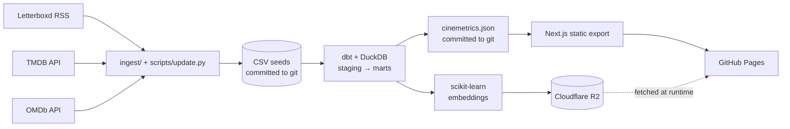
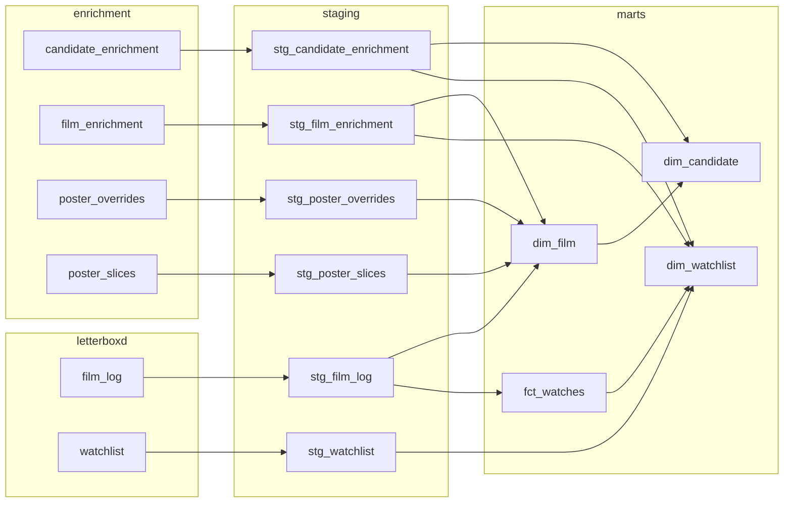

# Cinemetrics Architecture

A single-user analytics pipeline that turns a Letterboxd watch history into a static,
interactive dashboard. Every stage runs either in a GitHub Actions runner or in the visitor's
browser. There is no application server and no hosted database.

**Live:** [featheranalytics.dev/cinemetrics](https://featheranalytics.dev/cinemetrics)

Paths below link to the file they name. Generated and gitignored artifacts
(`data/movies.duckdb`, `data/ml/`, `transform/target/`, `web/public/dbt/`) are left unlinked,
since they do not exist in the repository.

## The shape of it



Two artifacts leave the pipeline. A ~748 KB JSON file ships inside the site bundle. R2 serves the embeddings in a ~1 MB gzipped file.

## Layers

| Layer | Lives in | DuckDB schema | Materialization | Purpose |
|---|---|---|---|---|
| **Sources** | Letterboxd RSS, TMDB, OMDb | — | HTTP | Watch events, film attributes, critic scores |
| **Seeds** | [`transform/seeds/`](../transform/seeds/) | `letterboxd`, `enrichment` | Committed CSVs | The source of truth. Append-only. |
| **Staging** | [`transform/models/staging/`](../transform/models/staging/) | `staging` | Views | Typing, cleaning, derived columns |
| **Marts** | [`transform/models/marts/`](../transform/models/marts/) | `marts` | Tables | [`dim_film`](../transform/models/marts/dim_film.sql), [`fct_watches`](../transform/models/marts/fct_watches.sql), [`dim_candidate`](../transform/models/marts/dim_candidate.sql) |
| **Export** | [`scripts/export_web.py`](../scripts/export_web.py) | — | JSON | Flattens marts into what the browser reads |
| **ML** | [`recommend/`](../recommend/), [`scripts/train_embeddings.py`](../scripts/train_embeddings.py) | — | JSON → R2 | Sparse feature vectors for recommendations |
| **Web** | [`web/`](../web/) | — | Static HTML | Next.js static export, all rendering client-side |

### Schemas

The database mirrors the layers, so the **Database** tab of the
[data model docs](https://featheranalytics.dev/cinemetrics/dbt/) reads the way the pipeline does:

```
movies.duckdb
  letterboxd/   film_log, watchlist
  enrichment/   film_enrichment, candidate_enrichment, poster_slices, poster_overrides
  staging/      stg_film_log, stg_watchlist, stg_film_enrichment, stg_candidate_enrichment,
                stg_poster_slices, stg_poster_overrides
  marts/        dim_film, fct_watches, dim_candidate
```

Seeds are split by where the data came from rather than by the fact that they are seeds:
`film_enrichment` and `candidate_enrichment` hold TMDB and OMDb attributes, so filing them under
`letterboxd` would assert something false about their provenance.

Two consequences worth knowing:

- **[`macros/generate_schema_name.sql`](../transform/macros/generate_schema_name.sql) overrides
  dbt's default.** Out of the box dbt prefixes custom schemas with the target schema, which would
  name every relation `main_marts.dim_film`. The prefix exists so several developers can share one
  warehouse; this project has one target and a disposable local file, so it only added noise.
- **Python has to qualify mart references** — `marts.dim_film`, not `dim_film`. Nothing sets a
  DuckDB `search_path`, deliberately: an unqualified name that silently resolves to the wrong
  schema is worse than one that fails.

### Lineage

Generated from the dbt manifest, so it is the DAG dbt actually ran rather than a drawing of it.
The [data model docs](https://featheranalytics.dev/cinemetrics/dbt/) carry the same graph
interactively — click the icon at the bottom-right of any model page, where you also get column
descriptions and test results. This copy exists so the shape is legible without leaving the repo.

<!--lineage:begin-->

<!--lineage:end-->

The graph shows one thing worth knowing: **`stg_watchlist` currently has no consumer.** No mart
selects from it, [`export_web.py`](../scripts/export_web.py) does not export it, and nothing in
[`web/`](../web/) references a watchlist. The seed is built by
[`build_watchlist_seed.py`](../scripts/build_watchlist_seed.py) and the model is typed and tested,
but the branch stops there — it is staged and ready rather than in use.

Current scale: <!--stat:watches-->798<!--/stat--> watches, <!--stat:films-->676<!--/stat--> films, <!--stat:candidates-->10,288<!--/stat--> recommendation candidates, <!--stat:dbt_models-->10<!--/stat--> dbt models, <!--stat:dbt_seeds-->6<!--/stat--> seeds, <!--stat:dbt_tests-->40<!--/stat--> data tests.

Those figures are generated — see [Keeping the figures honest](#keeping-the-figures-honest). The
dashboard header and the share card derive their own counts separately at build time, from
[`web/src/lib/summary.ts`](../web/src/lib/summary.ts).

### Why the seeds are the source of truth

The DuckDB file (`data/movies.duckdb`) is gitignored and disposable. Every run rebuilds it
from the seeds. So the entire dataset is a diffable set of CSVs in git history, and any build
(local, CI, or deploy) starts from identical inputs.

The six seeds: [`film_log.csv`](../transform/seeds/film_log.csv) (watch events),
[`film_enrichment.csv`](../transform/seeds/film_enrichment.csv) (attributes for watched films),
[`candidate_enrichment.csv`](../transform/seeds/candidate_enrichment.csv) (the recommendation
pool), [`watchlist.csv`](../transform/seeds/watchlist.csv),
[`poster_slices.csv`](../transform/seeds/poster_slices.csv) (20-stop colour columns sampled from
each poster), and [`poster_overrides.csv`](../transform/seeds/poster_overrides.csv) (the films
whose default TMDB art is not the art wanted). Their column types are pinned in
[`dbt_project.yml`](../transform/dbt_project.yml).

`poster_overrides` is the one seed no script writes. It is a curation, like the franchise rollups
in [`franchise_mapping()`](../transform/macros/), and it is data rather than a constant in
[`web/`](../web/) because a curated poster has two consumers — the poster image and the barcode
stripe sampled from it — and only the pipeline can serve both.
[`dim_film.poster_path`](../transform/models/marts/dim_film.sql) coalesces the override over the
enrichment seed, so it is the single answer to which art a film gets and no renderer needs a
helper of its own. Changing an override means re-sampling its slice:
[`reslice_overridden_posters.py`](../scripts/reslice_overridden_posters.py), because the nightly
[`backfill_poster_slices.py`](../scripts/backfill_poster_slices.py) only fetches films that have
no slice at all.

Two rules protect this:

- **Append-only.** The auto-updater only adds rows; it never rewrites existing ones. One-off
  repairs go in their own script under [`scripts/`](../scripts/) behind an `--apply` flag —
  see [`backfill_likes.py`](../scripts/backfill_likes.py) or
  [`repair_release_years.py`](../scripts/repair_release_years.py) for the pattern.
- **LF line endings.** [`.gitattributes`](../.gitattributes) checks seeds out as LF, and all
  CSV writing goes through [`ingest/csvio.py`](../ingest/csvio.py) rather than the stdlib `csv`
  writer, which emits CRLF on every platform. Mixed endings make DuckDB's CSV sniffer fail the
  dbt build.

### Three-state columns

`liked` and `is_rewatch` are effectively three-state: true, false, and unknown. The
<!--stat:sheet_era-->129<!--/stat--> pre-Letterboxd rows (imported from a Google Sheet) never
recorded them. `liked` is stored as a nullable boolean, so the unknowns are NULL. `is_rewatch` is
stored as `false` for those rows, which is *not* the same as "was a first viewing". Filter on
`liked is not null` to isolate the rows that actually recorded either field. Ignoring this
understates the affection rate by <!--stat:affection_delta-->7.5<!--/stat--> points and the
rewatch rate by <!--stat:rewatch_delta-->5.1<!--/stat--> points.

The derivation and its reasoning live in
[`stg_film_log.sql`](../transform/models/staging/stg_film_log.sql).

**Most of the rewatch unknowns are recoverable, and are recovered.** Whether a viewing
was a return does not depend on the source having recorded it — it depends on whether an
earlier watch of the same film is already in the data.
[`fct_watches`](../transform/models/marts/fct_watches.sql) therefore derives two more
columns: `is_return`, which is that ordinal test, and `is_rewatch_effective`, the union of
it with the recorded flag. The dashboard filters on the union.

Neither half is sufficient alone. The flag misses every sheet-era return — Midsommar's
2019-10-06 entry is the second time that film appears and the flag calls it a first
viewing. The ordinal misses the <!--stat:flagged_once-->87<!--/stat--> films whose single
row is flagged because the original viewing predates the dataset, where the flag is the
only evidence. Together they move 11 rows, 6 of them sheet-era.

What stays unknown is a sheet-era row that is its film's first appearance: whether it
returned to a viewing from before the data begins cannot be recovered. So the rewatch rate
still divides by rows the data can actually answer for — now `liked is not null or
is_return` rather than `liked is not null` alone.

### The recommendation path

[`scripts/train_embeddings.py`](../scripts/train_embeddings.py) reads the marts, encodes each
film with a TF-IDF and multi-hot feature encoder
([`recommend/encode.py`](../recommend/encode.py)), and writes sparse vectors as JSON via
[`recommend/model.py`](../recommend/model.py). It skips the work entirely when a hash of the
input data is unchanged.

The similarity math runs **in the browser**: the client
([`web/src/lib/recommend.ts`](../web/src/lib/recommend.ts)) builds a rating-weighted taste
vector from the ratings and scores candidates by cosine similarity, with the "Why this film"
copy coming from [`web/src/lib/explainClient.ts`](../web/src/lib/explainClient.ts).
Recommendations therefore respond live to the dashboard filters, since nothing is precomputed
server-side. A k-NN taste predictor was evaluated but did not beat critic scores, so it remains
an offline tool ([`scripts/eval_taste.py`](../scripts/eval_taste.py), backed by
[`recommend/taste.py`](../recommend/taste.py)).

## Infrastructure

Everything is free-tier and stateless except the object store.

| Concern | Service | Notes |
|---|---|---|
| Compute | GitHub Actions | `ubuntu-latest`, Python 3.11 via `uv`, Node 22 |
| Hosting | GitHub Pages | Static export, `basePath: /cinemetrics` ([`next.config.ts`](../web/next.config.ts)) |
| Large artifacts | Cloudflare R2 | Bucket `cinemetrics-ml`, public dev URL ([`upload_r2.py`](../scripts/upload_r2.py)) |
| Data store | DuckDB (ephemeral) | Rebuilt from seeds; never persisted ([`profiles.yml`](../transform/profiles.yml)) |
| Secrets | GitHub Actions secrets | TMDB, OMDb, Letterboxd user, R2 credentials ([`.env.example`](../.env.example)) |

### Workflows

**[`ci.yml`](../.github/workflows/ci.yml)** — on pull requests to `main`. Three independent
jobs: `lint` (ruff + eslint), `data` (`dbt deps` then `dbt build`, which runs all
<!--stat:dbt_tests-->40<!--/stat--> tests), and `web` (vitest + Next.js build).

**[`deploy.yml`](../.github/workflows/deploy.yml)** — on push to `main` and on manual dispatch.
Builds the web bundle and publishes to Pages. Concurrency group `pages`, no
cancel-in-progress.

It also generates the dbt documentation site. The catalog has no relations to describe until
the seeds are built, and the DuckDB file is gitignored, so the deploy job runs `dbt deps` and
`dbt build` before `dbt docs generate --static`. That produces a self-contained
`static_index.html` (~2.6 MB, ~600 KB over the wire), which gets copied to
`web/public/dbt/index.html` and published by the static export at `/cinemetrics/dbt/`. The
site footer ([`Footer.tsx`](../web/src/components/Footer.tsx)) links to it as "Data model
docs".

That file is generated rather than authored, so it is gitignored. Run `make docs` to produce
it locally. Its landing page comes from
[`transform/models/overview.md`](../transform/models/overview.md) via dbt's
`` block.

### The share card

The Open Graph image at `/cinemetrics/og.png` is generated at build time by
[`web/src/app/og.png/route.tsx`](../web/src/app/og.png/route.tsx), using `next/og` and the same
`cinemetrics.json` the page imports. It replaced a committed PNG whose text had been baked into
pixels, and which by then claimed "Seven years · 794 films" — 794 being the viewing count, not
the film count.

Two things about it are deliberate and easy to undo by accident:

- **It is a Route Handler, not the `opengraph-image` file convention.** Under
  `output: "export"` the convention writes an extensionless `out/opengraph-image`, and GitHub
  Pages types responses by extension, so the card would ship as
  `application/octet-stream`. A dotted route segment (`app/og.png/`) puts the `.png` back in the
  path. Because the convention is not in play,
  [`layout.tsx`](../web/src/app/layout.tsx) sets `og:image` and `twitter:image` by hand.
- **It declares `export const dynamic = "force-static"`.** A static export refuses to build a
  Route Handler without it.

The card uses the Geist Regular that `next/og` bundles rather than loading the site's fonts,
which would mean committing a font binary or fetching one mid-build.

**[`update-data.yml`](../.github/workflows/update-data.yml)** — daily at 08:23 UTC, plus manual
dispatch.

1. [`scripts/update.py`](../scripts/update.py): fetch Letterboxd RSS
   ([`ingest/letterboxd.py`](../ingest/letterboxd.py)), enrich any new films via TMDB
   ([`ingest/tmdb.py`](../ingest/tmdb.py)) and OMDb ([`ingest/omdb.py`](../ingest/omdb.py)),
   append to seeds, run `dbt build`, re-export the JSON.
2. If nothing changed, stop. Every subsequent step is gated on the diff.
3. Fetch new recommendation candidates from TMDB
   ([`scripts/fetch_candidates.py`](../scripts/fetch_candidates.py)).
4. Validate the candidate seed with `dbt build --select candidate_enrichment+`, scoped to that
   path because step 1 already built and tested everything else.
5. Retrain embeddings and upload to R2.
6. Commit the seeds and JSON to `main`, then dispatch `deploy.yml`.

Concurrency group `update-data`, with `cancel-in-progress: false`. Two overlapping runs would
race on the same append and push, and cancelling a run that has already appended locally is
worse than letting it finish. The job needs `contents: write` to push and `actions: write` to
dispatch the deploy; declaring `permissions` at all drops every unlisted scope to none.

### Guardrails worth knowing about

- **[`update.py`](../scripts/update.py) aborts** if the RSS feed yields an implausible number
  of new watches, on the assumption that a parse error is more likely than a viewing binge.
- **`update.py` holds a watch back** if that film's enrichment fails, so no watch lands
  without its attributes.
- **[`upload_r2.py`](../scripts/upload_r2.py) gzips the embeddings** with `mtime=0`. An
  unchanged artifact then produces identical bytes instead of a spurious diff, and the ~1 MB
  transfer becomes a property of the artifact rather than a CDN setting that could quietly
  change.
- **[`ingest/http.py`](../ingest/http.py) injects `truststore`** lazily, so TMDB and OMDb calls
  verify against the OS trust store. Without it, every call fails on a machine behind a
  TLS-intercepting proxy, whose private CA is not in certifi's bundled roots.

## Local development

Every target below is defined in the [`Makefile`](../Makefile).

```bash
make setup      # uv sync + dbt deps + npm ci
cp .env.example .env
make build      # dbt build → export JSON → train embeddings → web build
make dev        # Next.js dev server on :3000
make test       # ruff + eslint + dbt build (tests) + vitest
```

Other targets: `make update` (RSS pipeline), `make candidates`, `make train` / `make retrain`,
`make upload`, `make docs` (dbt docs site), `make clean`.

dbt runs from [`transform/`](../transform/) with `--profiles-dir .`. The committed
[`profiles.yml`](../transform/profiles.yml) holds no secrets; it just points DuckDB at
`../data/movies.duckdb`.

## Repository layout

| Path | Contents |
|---|---|
| [`ingest/`](../ingest/) | TMDB + OMDb clients, RSS and export parsing, CSV I/O |
| [`transform/`](../transform/) | dbt project: seeds → staging → marts, [`franchise_mapping`](../transform/macros/franchise_mapping.sql) macro |
| [`recommend/`](../recommend/) | Feature encoding, embedding export, explainability, taste eval |
| [`scripts/`](../scripts/) | update, export, candidate fetch, training, R2 upload, one-off repairs |
| [`web/`](../web/) | Next.js dashboard (D3 charts, cross-filtering, URL state) |
| [`tests/`](../tests/) | pytest: encoding, model, ingest, taste eval |
| `data/` | `movies.duckdb` + `ml/` (both gitignored) |
| [`docs/`](../docs/) | This document |

## Keeping the figures honest

Counts quoted in this document and on the dbt docs landing page, plus the lineage diagram, are
generated by [`scripts/update_doc_stats.py`](../scripts/update_doc_stats.py) from the built marts
and the dbt manifest. It needs both, so run it after `dbt build`.
`update-data.yml` runs it after the daily rebuild and commits the docs alongside the seeds.
Locally, `make doc-stats` rewrites them; `make test` and CI run `update_doc_stats.py --check`,
which fails if any figure disagrees with the data.

Two mechanisms, because the two files are rendered by different things:

- **This file is edited in place.** Each figure sits inside an inline marker, so the prose around
  it stays hand-written. GitHub renders HTML comments invisibly.

  ```markdown
  but <!--stat:flagged_once-->87<!--/stat--> of those are films whose first viewing ...
  ```

  The lineage diagram uses a block marker of the same kind
  (`<!--lineage:begin-->

<!--lineage:end-->`) and is regenerated wholesale.

- **[`overview.md`](../transform/models/overview.md) is rendered from
  [`overview.md.tmpl`](../transform/models/overview.md.tmpl)** and must not be edited directly.
  dbt's docs renderer escapes HTML comments and prints them as literal text on the published
  page, so the generated file has to come out with no markers in it at all. Placeholders look
  like `%%stat:flagged_once%%` and live only in the template. The output is committed, because
  `dbt docs generate` reads it from a clean checkout during deploy.

**The query is the definition.** Most of these figures admit more than one defensible reading,
and the prose asserts one. "<!--stat:flagged_once-->87<!--/stat--> flagged rewatches appear only
once" means *the film has exactly one row*; counting flagged rows that are merely the earliest row
held for their film gives <!--stat:flagged_earliest_row-->98<!--/stat-->, because a film can have a
flagged first viewing and later returns.
Both numbers are correct about different things. Swapping one for the other would republish a
different claim under the same sentence, so
[`tests/test_doc_stats.py`](../tests/test_doc_stats.py) pins the relationships and fails the build
if a definition drifts.

Figures the script does not own, because they are not derived from the data: artifact sizes, and
anything in the README.

## Conventions

- **Primary key** is `tmdb_id` (integer). `imdb_id` is kept as a secondary identifier for
  external links, and its not-null test is a warning rather than an error. Both are declared in
  [`_marts.yml`](../transform/models/marts/_marts.yml).
- **Ratings** are 0–100 (`my_rating`); `star_rating` is 0–5. The factor is exactly 20,
  measured across the <!--stat:seed_rows_both-->669<!--/stat--> rows that arrived carrying both.
  Derived in [`stg_film_log.sql`](../transform/models/staging/stg_film_log.sql).
- **"Rewatches" and "returns" are different numbers.**
  <!--stat:flagged_rewatches-->209<!--/stat--> rows are flagged as rewatches, but
  <!--stat:flagged_once-->87<!--/stat--> of those are films whose first viewing predates the
  dataset. Counting actual return visits in the data gives
  <!--stat:returns-->122<!--/stat--> returns across
  <!--stat:films_with_returns-->84<!--/stat--> films. Always state which one a figure means.
- **Franchise rollups** are curated in the
  [`franchise_mapping()`](../transform/macros/franchise_mapping.sql) macro, keyed by TMDB
  collection, `tmdb_id`, or director.
- Feature branches only. The single exception is the automated data commit, which pushes to
  `main` directly.

## See also

- [`README.md`](../README.md) — what the dashboard does, from a visitor's point of view
- [`CLAUDE.md`](../CLAUDE.md) — the same constraints, condensed for AI assistants
- [Data model docs](https://featheranalytics.dev/cinemetrics/dbt/) — generated dbt catalog and
  lineage graph
